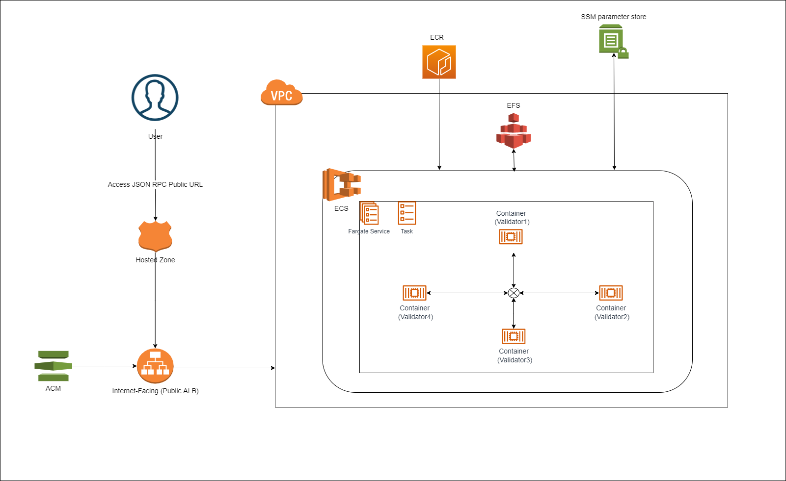

# Blockchain CDK for Deploying Polygon-Edge On Cloud



Creates Infrastructure on AWS to deploy Polygon-Edge:
- VPC if not present (pass existing VPC to use the same)
- ECR repo, (Also builds and pushes Docker Image to ECR repo during `cdk deploy`)
- EFS for storing blockchain state persistently.
- ECS Service and Task Definition with 4 ECS containers for validators
  - All containers can communicate each other via localhost since they are under ECS service and  task-definition with network-mode as `awsvpc`
  - If for some reasons, you need to separate the validator nodes into separate ECS services, then App-Mesh can be integrated.
    - This cut downs Loadbalancers, DNS query costs.
- IF ALB (Application Load Balancer) doesn't exist, it creates ALB, Target groups, Listener Rules and ACM certificate
  - If ALB exists and want to use the same, pass `ALB_EXISTS` as true in the config, but have to create Target groups, Listener Rule and hosted zone manually.
- Creates HostedZone if it doesn't exist. Configure if already exists

This package also has code to create Polygon-Edge Blockchain (Checkout `src/validator`)
- It Creates Genesis file if not present and store the secrets in SSM parameter store for first time.
- It persists the blockchain state in EFS and starts validator node(server).
- The validator node can be restarted, it will use existing genesis file and blockchain state


### Polygon-Edge Specifics:
- Creates 4 validator nodes as recommended for crash Tolerance and BFT Guarantee. [Reference](https://edge-docs.polygon.technology/docs/get-started/set-up-ibft-on-the-cloud)
- validator1 node creates the `genesis.json` file for first time if not present and stores the secrets in SSM Parameter store if STAGE is not "localhost"
- Out of 4 nodes, only validator1's JSONRPC_PORT (10002) is exposed to public.
  - The domain would be as configured in config directory. ex: `https://blockchain.your-company.com`

## Useful commands

* `npm run build`   compile typescript to js
* `npm run watch`   watch for changes and compile
* `npm run test`    perform the jest unit tests
* `cdk deploy`      deploy this stack to your default AWS account/region
* `cdk diff`        compare deployed stack with current state
* `cdk synth`       emits the synthesized CloudFormation template

The `cdk.json` file tells the CDK Toolkit how to execute your app.

### How to run
1. Create `config/[STAGE].json` file ex: `config/prod.json`
NOTE:
- config package is used, hence config/prod.json can be accessed when NODE_ENV is set to prod
- default.json is used by default for any NODE_ENV

Configure your details, (There exists `config/default.json` file to start with)
```json5
{
  "STAGE": "prod", // use "localhost" if you don't want to store the secrets in SSM parameter store
  "ACCOUNT_ID": "XXX511334XXX", // AWS Account ID
  "REGION": "us-west-1", // AWS region to deploy the stack
   // wallet account address, This account will be pre-mined with tokens
  "GENESIS_ACCOUNT": "0xXXXX4Af469FE0F501a0A94c2f45EXXXXXXXXX03",
  "PREMINE_NUM_TOKENS_IN_WEI": "100000000000000000000000000",
  "BLOCKCHAIN_NAME": "YOUR_BLOCKCHAIN_NAME",

   // if you want your blockchain to be reachable by say blockchain.your-company.com
   // AWS needs a hosted-zone in Route53 with your-company.com
   // Don't worry if not created, this will be handled by the CDK.
  "HOSTED_ZONE_NAME": "your-company.com",
  "SUBDOMAIN": "blockchain", //FQDN (Fully qualified domain name would be blockchain.your-company.com)
  "OPTIONAL_EXISTING_HOSTED_ZONE_ID": "Z3TRGGK18XXXXX",
  "OPTIONAL_EXISTING_VPC_ID": "",
  "ALB_EXISTS": false
}
```
2. Get AWS Credentials, Can have two Roles.
   1. Admin Access
      1. This is to deploy Bootstrap stack (CDKToolKit), This is one time action and prerequisite for deploying InfraStack
      2. This deploys necessary artifacts used by the Infra stack.
      3. After bootstrapping Admin access can be removed.
   2. CDK Deployment Role
      1. This is to deploy Infra stack, this will have all minimal permissions to deal with CDK.
      2. IAM Role should be having below Policy Statement.
   ```json
   {"Version":"2012-10-17","Statement":[{"Effect":"Allow","Action":["sts:AssumeRole"],"Resource":["arn:aws:iam::*:role/cdk-*"]}]}
   ```
3. Configure aws profile by getting aws credentials. Don't need to use `--profile` anywhere if you already have admin access as default.
`aws configure --profile [profile_name]`
4. Deploy the cdk bootstrap (use admin access Role)
`cdk bootstrap --profile [profile_name]`
5. Deploy the stack (Recommended: use cdk deployment Role's profile)
`cdk deploy --profile [profile_name]`

NOTE: If your domain is not validated in AWS, CDK waits until the validation is done. This would send mails to listed emails. [Reference](https://docs.aws.amazon.com/acm/latest/userguide/email-validation.html)

### Actions to REPLACE the created blockchain.
- There might be situations where you want to recreate your blockchain with some modified parameters. ex: with an increase in premined tokens. Once genesis.json file is created, most of the parameters are not modifiable, hence blockchain has to be recreated.

Steps in the same order:
1. Delete the ECR repo created by CDK manually. This is a stateful resource and had to be deleted manually.
2. Delete the Infra stack, either from AWS cloudformation or using `cdk destroy --profile [profile_name]`
   Note: No need to delete the Bootstrap stack.
3. Delete the EFS if not needed, this is a stateful resource and will be skipped when stack is deleted, hence this has to be deleted manually
4. Delete the records from AWS SSM parameter store with Key prefix "/blockchain/validator"
